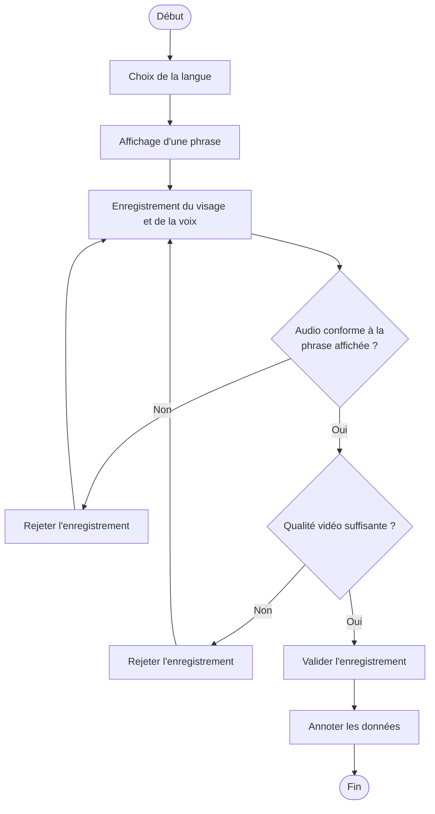

<h1> Acquisition de données pour la lecture labiale phonétique </h1>
Développement d'une solution logiciel permettant l'acquisition de données pour l'analyse de séries temporelles par apprentissage profond pour la lecture labiale phonétique.

<h3> Processus d’acquisition, validation et annotation des données : </h3>

