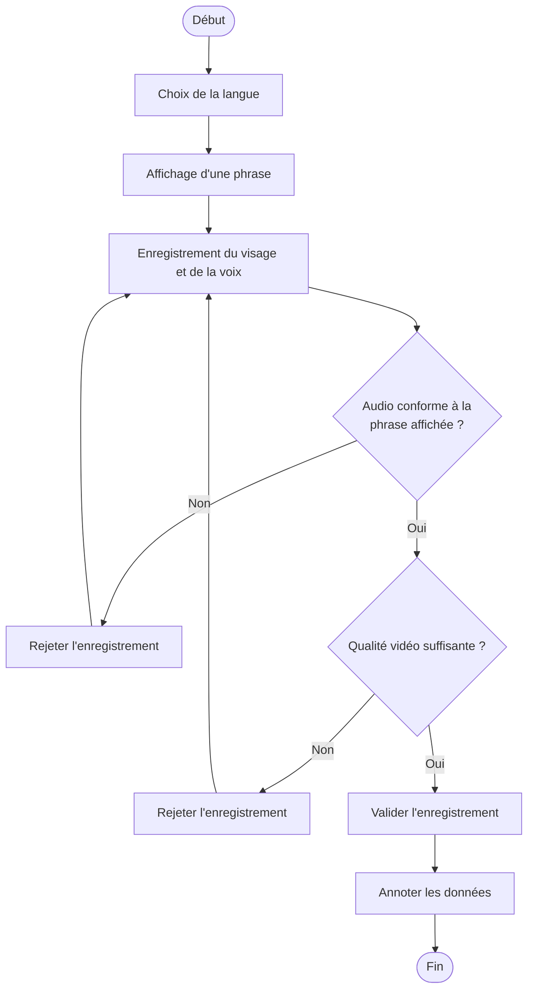

<h1> Acquisition de données pour la lecture labiale phonétique </h1>
Développement d'une solution logiciel permettant l'acquisition de données pour l'analyse de séries temporelles par apprentissage profond pour la lecture labiale phonétique.

<h3> Processus d’acquisition, validation et annotation des données : </h3>


```mermaid
flowchart TD
    A([Début]) --> B[Choix de la langue]
    B --> C[Affichage d'une phrase]
    C --> D[Enregistrement du visage et de la voix]

    D --> E{Audio conforme à la\nphrase affichée ?}
    
    E -- Non --> F[Rejeter l'enregistrement]
    F --> D
    
    E -- Oui --> G{Qualité vidéo suffisante ?}
    
    G -- Non --> H[Rejeter l'enregistrement]
    H --> D
    
    G -- Oui --> I[Valider l'enregistrement]
    I --> J[Annoter les données]
    J --> K([Fin])
```

```mermaid
classDiagram

    class MyWindow {
        - media_manager : MediaManager
        - corpus_manager : CorpusManager
        - recording_indicator : RecordingIndicator
        + button_record_clicked()
        + display_current_sentence()
        + update_sentence_counter()
        + connect_signals()
    }

    class MediaManager {
        - camera
        - audio_input
        - capture_session
        - recorder
        - video_widget
        - video_bitrate
        - recording_output_location
        - h264_fallback_tried
        + load_microphones()
        + load_cameras()
        + refresh_microphones()
        + refresh_cameras()
        + start_camera_preview()
        + configure_camera_format()
        + setup_recording()
        + start_recording(language_code)
        + stop_recording()
        + restart_recording_with_mpeg4()
    }

    class CorpusManager {
        - corpus_dir
        - language_selected
        - languages
        - corpus_data
        - sentence
        - sentence_count
        - sentence_total
        + load_languages()
        + select_language(index)
        + collect_template()
        + get_current_sentence()
        + consume_current_sentence()
        + has_remaining_sentences()
    }

    class RecordingIndicator {
        - label_record_timer
        - label_record_dot
        - blink_timer
        - record_timer
        - record_seconds
        - blink_visible
        + start()
        + stop()
        + blink_dot()
        + update_record_timer()
        + set_timer_text(text)
    }

    class FileUtils {
        <<module>>
        + ensure_directory_exists(path)
        + get_language_data_dir(data_dir, language_code)
        + generate_recording_base_name(language_code)
        + build_video_filepath(data_dir, language_code)
    }

    class Config {
        <<module>>
        + BASE_DIR
        + DATA_DIR
        + CORPUS_DIR
        + SENTENCE_NUMBER
        + BLINK_INTERVAL_MS
        + RECORD_TIMER_INTERVAL_MS
        + AUDIO_BITRATE
        + VIDEO_BITRATE_LOW
        + VIDEO_BITRATE_MEDIUM
        + VIDEO_BITRATE_HIGH
    }

    MyWindow --> MediaManager : utilise
    MyWindow --> CorpusManager : utilise
    MyWindow --> RecordingIndicator : utilise

    MediaManager --> FileUtils : crée les chemins vidéo
    MediaManager --> Config : lit les constantes

    CorpusManager --> Config : lit CORPUS_DIR / SENTENCE_NUMBER
    RecordingIndicator --> Config : lit les intervalles timer
    ```