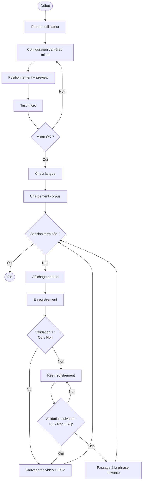
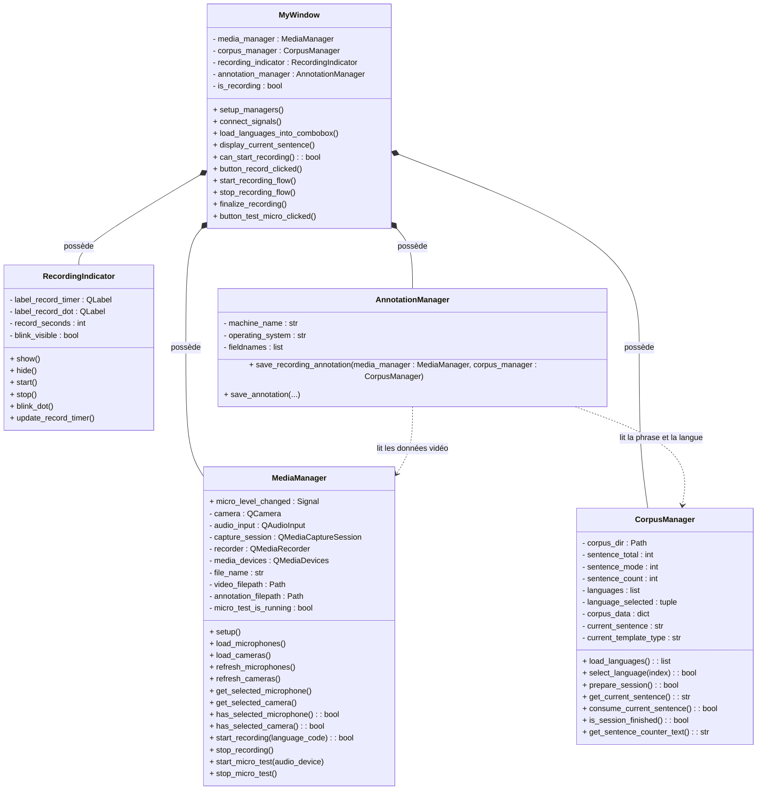

## Présentation générale de l'application d'acquisition

L'application d'acquisition constitue la première étape du pipeline de création du corpus audio-vidéo. Elle permet d'enregistrer un utilisateur pendant la lecture de phrases issues d'un corpus linguistique prédéfini. Chaque enregistrement produit une vidéo, accompagnée d'un fichier d'annotation contenant les métadonnées utiles : langue, phrase lue, type de template, périphériques utilisés, informations techniques du fichier vidéo et statut de validation.

Le fonctionnement général suit une logique de session. L'utilisateur renseigne d'abord son prénom, configure la caméra et le microphone, puis effectue un test micro. Une fois les périphériques validés, il choisit la langue de lecture. Le corpus correspondant est alors chargé, puis les phrases sont affichées une par une. Pour chaque phrase, l'utilisateur peut enregistrer une vidéo, la valider, la recommencer ou, après un premier échec, passer à la phrase suivante.

L'objectif principal de cette application est de garantir une acquisition structurée et exploitable des données. Les vidéos sont sauvegardées dans une arborescence organisée par langue, tandis que les annotations associées permettent ensuite à l'application d'annotation de retrouver automatiquement les informations nécessaires au traitement avec Whisper.

Le diagramme de flux ci-dessous présente le déroulement fonctionnel d'une session d'acquisition.



## Architecture de l'application d'acquisition

L'application d'acquisition est structurée autour de plusieurs composants ayant chacun une responsabilité précise. La fenêtre principale coordonne le déroulement de la session, tandis que des gestionnaires spécialisés prennent en charge les périphériques audio-vidéo, le corpus, l'indicateur d'enregistrement et la sauvegarde des annotations.

Cette organisation permet de séparer la logique d'interface, la logique métier et les traitements techniques. Elle facilite également l'évolution du projet, notamment l'ajout de l'application d'annotation, qui pourra réutiliser certains modules ou certaines données produites par l'acquisition.

### Diagramme de classes

Le diagramme de classes présente les principales classes de l'application d'acquisition et leurs relations. Il met en évidence le rôle central de `MyWindow`, qui possède et coordonne les différents gestionnaires : `MediaManager`, `CorpusManager`, `RecordingIndicator` et `AnnotationManager`.

Chaque classe est représentée avec ses principaux attributs et méthodes afin de donner une vue synthétique de l'organisation interne du code. Ce diagramme ne représente que les véritables classes Python du projet ; les fichiers contenant uniquement des fonctions utilitaires sont volontairement exclus de ce diagramme.



### Diagramme de dépendances entre modules

Le diagramme de dépendances complète le diagramme de classes en montrant les relations entre les fichiers Python de l'application. Contrairement au diagramme de classes, il peut représenter aussi bien des fichiers contenant des classes que des modules utilitaires.

Ce diagramme permet de visualiser quels modules dépendent les uns des autres. Il montre notamment que `main_window.py` orchestre les principaux gestionnaires, tandis que certains modules s'appuient sur des fichiers communs comme `config_loader.py`, `file_utils.py` ou `media_utils.py` pour charger la configuration, construire les chemins de fichiers ou extraire les métadonnées vidéo.

    ```mermaid
    flowchart TD
    MW[main_window.py<br/>MyWindow]

    MM[media_manager.py<br/>MediaManager]
    CM[corpus_manager.py<br/>CorpusManager]
    AM[annotation_manager.py<br/>AnnotationManager]
    RI[recording_indicator.py<br/>RecordingIndicator]

    CL[config_loader.py<br/>load_config()]
    FU[file_utils.py<br/>fonctions de chemins]
    MU[media_utils.py<br/>fonctions média]

    MW --> MM
    MW --> CM
    MW --> AM
    MW --> RI

    MM --> CL
    CM --> CL

    MM --> FU
    MM --> MU
    AM --> FU
    AM --> MU
```