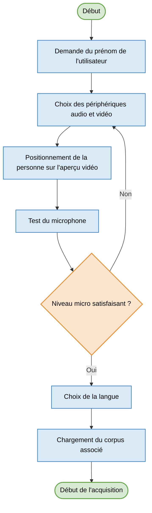
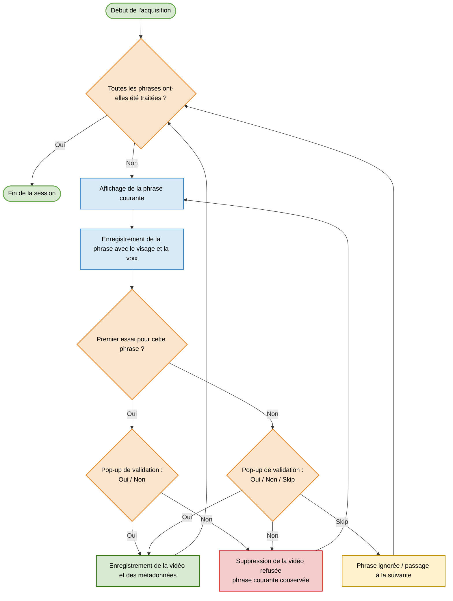
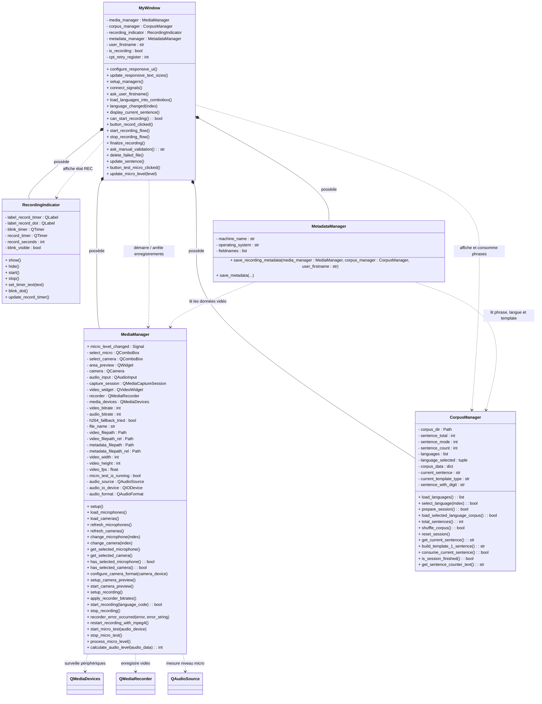
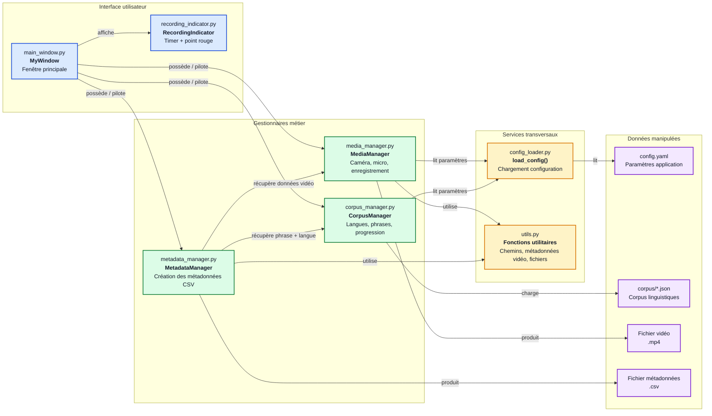

## Installation et lancement

Cette application correspond à la partie acquisition du projet. Elle permet d'enregistrer les vidéos et de générer le dossier `data` utilisé ensuite par l'application d'annotation.

Les commandes ci-dessous sont à exécuter depuis la racine du dépôt `acquisition_donnees`.

### 1. Préparer un environnement Python

L'application nécessite Python 3.12.

La version est déclarée dans `pyproject.toml`, mais ce fichier ne sélectionne pas automatiquement l'interpréteur Python. Il indique seulement à `pip` quelles versions sont acceptées. Il faut donc lancer les commandes depuis un environnement qui utilise déjà Python 3.12.

#### Windows PowerShell avec `.venv`

```powershell
cd acquisition_project
py -3.12 -m venv .venv
.\.venv\Scripts\Activate.ps1
python -m pip install --upgrade pip
python -m pip install -e .
```

La commande `py -3.12 -m venv .venv` sert uniquement à créer un nouvel environnement virtuel avec Python 3.12. Si l'environnement existe déjà, il suffit de l'activer.

Si la commande `py -3.12` n'est pas reconnue, installer Python 3.12 puis relancer la commande. Il est aussi possible d'utiliser le chemin complet vers `python.exe` 3.12 :

```powershell
C:\chemin\vers\Python312\python.exe -m venv .venv
```

Le projet ne s'installe pas avec Python 3.11. Si l'environnement `.venv` a déjà été créé avec Python 3.11, il faut le supprimer puis le recréer avec Python 3.12.

#### Linux / macOS

```bash
cd acquisition_project
python3.12 -m venv .venv
source .venv/bin/activate
python -m pip install --upgrade pip
python -m pip install -e .
```

#### Avec conda

Si un environnement conda Python 3.12 existe déjà, il peut être utilisé à la place de `.venv`. Si vous n'en avez pas et que vous souhaitez en créer un :

```powershell
conda create -n acquisition-python312 python=3.12
```

Dans un terminal où conda est disponible :

```powershell
conda activate acquisition-python312
cd acquisition_project
python --version
python -m pip install --upgrade pip
python -m pip install -e .
```

La commande `python --version` doit afficher Python 3.12. Si `pip` affiche une erreur indiquant Python 3.11, c'est que l'environnement conda n'est pas actif dans ce terminal. Dans ce cas, ouvrir un terminal conda, activer l'environnement, puis utiliser `python -m pip` plutôt que `pip`.

### 2. Lancer l'application

Depuis le dossier `acquisition_project`, avec l'environnement activé :

```bash
python -m acquisition.main
```

Il est aussi possible de fournir directement le prénom de l'utilisateur :

```bash
python -m acquisition.main --firstname Alice
```

### 3. Modifier l'interface Qt

L'interface graphique est décrite dans le fichier Qt Designer :

```text
acquisition/ui/main_pyside.ui
```

Depuis le dossier `acquisition_project`, avec l'environnement activé, ouvrir l'interface dans Qt Designer :

```powershell
pyside6-designer acquisition\ui\main_pyside.ui
```

Après modification du fichier `.ui`, régénérer le fichier Python utilisé par l'application :

```powershell
pyside6-uic acquisition\ui\main_pyside.ui -o acquisition\ui\ui_main_pyside6.py
```

Relancer ensuite l'application pour vérifier les changements :

```powershell
python -m acquisition.main
```

### 4. Construire l'exécutable Windows

La construction de l'exécutable est optionnelle. Elle nécessite les dépendances de build :

```powershell
cd acquisition_project
python -m pip install -e ".[build]"
.\build_exe.ps1
```

Ces deux lignes sont deux commandes séparées :

- `python -m pip install -e ".[build]"` installe le projet Python avec les dépendances nécessaires à la construction, en utilisant le Python de l'environnement actif.
- `.\build_exe.ps1` lance ensuite le script PowerShell qui construit l'exécutable.

Ne pas lancer `pip install -e .\build_exe.ps1` : `build_exe.ps1` est un script, pas un projet Python installable.

L'application compilée est ensuite générée dans :

```text
distribution/
└── AVDataCollector/
```

## Présentation générale de l'application d'acquisition

L'application d'acquisition constitue la première étape du pipeline de création du corpus audio-vidéo. Elle permet d'enregistrer un utilisateur pendant la lecture de phrases issues d'un corpus linguistique prédéfini. Chaque enregistrement produit une vidéo, accompagnée d'un fichier de métadonnées contenant les métadonnées utiles : langue, phrase lue, type de template, périphériques utilisés, informations techniques du fichier vidéo et statut de validation.

Le fonctionnement général suit une logique de session. L'utilisateur renseigne d'abord son prénom, configure la caméra et le microphone, puis effectue un test micro. Une fois les périphériques validés, il choisit la langue de lecture. Le corpus correspondant est alors chargé, puis les phrases sont affichées une par une. Pour chaque phrase, l'utilisateur peut enregistrer une vidéo, la valider, la recommencer ou, après un premier échec, passer à la phrase suivante.

L'objectif principal de cette application est de garantir une acquisition structurée et exploitable des données. Les vidéos sont sauvegardées dans une arborescence organisée par langue, tandis que les métadonnées associées permettent ensuite à l'application d'annotation de retrouver automatiquement les informations nécessaires au traitement avec MFA.

Les diagrammes de flux ci-dessous présentent le déroulement fonctionnel d'une session d'acquisition.
Le déroulement fonctionnel a été divisé en deux parties : la première correspond à la préparation de la session et la deuxième à la boucle d'acquisition.

### Préparation de la session d'acquisition



### Boucle d'enregistrement des phrases



## Architecture de l'application d'acquisition

L'application d'acquisition est structurée autour de plusieurs composants ayant chacun une responsabilité précise. La fenêtre principale coordonne le déroulement de la session, tandis que des gestionnaires spécialisés prennent en charge les périphériques audio-vidéo, le corpus, l'indicateur d'enregistrement et la sauvegarde des métadonnées.

Cette organisation permet de séparer la logique d'interface, la logique métier et les traitements techniques. Elle facilite également l'évolution du projet, notamment l'ajout de l'application d'annotation, qui pourra réutiliser certains modules ou certaines données produites par l'acquisition.

### Diagramme de classes

Le diagramme de classes présente les principales classes de l'application d'acquisition et leurs relations. Il met en évidence le rôle central de `MyWindow`, qui possède et coordonne les différents gestionnaires : `MediaManager`, `CorpusManager`, `RecordingIndicator` et `MetadataManager`.

Chaque classe est représentée avec ses principaux attributs et méthodes afin de donner une vue synthétique de l'organisation interne du code. Le diagramme ne cherche pas à lister toutes les méthodes techniques : il montre surtout les responsabilités importantes de chaque classe.



### Diagramme de dépendances entre modules

Le diagramme de dépendances complète le diagramme de classes en montrant les relations entre les fichiers Python de l'application. Contrairement au diagramme de classes, il peut représenter aussi bien des fichiers contenant des classes que des modules utilitaires.

Ce diagramme permet de visualiser quels modules dépendent les uns des autres. Il montre notamment que `main_window.py` orchestre les principaux gestionnaires, tandis que certains modules s'appuient sur des fichiers communs comme `config_loader.py`, `file_utils.py` ou `media_utils.py` pour charger la configuration, construire les chemins de fichiers ou extraire les métadonnées vidéo.


