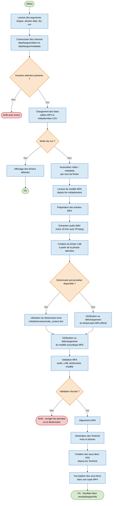

# Annotation automatique avec MFA

Ce projet utilise [Montreal Forced Aligner (MFA)](https://montreal-forced-aligner.readthedocs.io/) pour aligner la phrase attendue avec l'audio d'une vidéo. Pour chaque enregistrement, MFA produit un fichier TextGrid contenant deux niveaux d'annotation : les mots et les phones.

## 1. Prérequis

Installer une distribution Conda, par exemple Miniconda ou Miniforge.

FFmpeg doit aussi être installé sur le système, avec le filtre `ass`, car l'application l'utilise pour extraire l'audio des vidéos et incruster les sous-titres phonétiques.

Le fichier `environment.yml` utilise exclusivement le canal communautaire `conda-forge`. Les canaux Anaconda `defaults` sont désactivés pour cet environnement.

## 2. Créer l'environnement

L'environnement se nomme `annotation` et utilise Python 3.12. Choisir la procédure correspondant au système d'exploitation utilisé.

### Windows

Installer d'abord une version complète de FFmpeg :

```powershell
winget install Gyan.FFmpeg
```

Fermer puis rouvrir PowerShell, puis vérifier :

```powershell
where.exe ffmpeg
ffmpeg -filters | findstr ass
```

La commande doit afficher une ligne contenant `ass`, par exemple :

```text
ass               V->V       Render ASS subtitles onto input video
```

Ensuite, créer l'environnement :

```powershell
cd C:\chemin\vers\acquisition_donnees\annotation_project
conda env create -f environment.yml
conda activate annotation
mfa version
ffmpeg -filters | findstr ass
```

La commande de création doit être lancée lorsque l'invite de commande se termine par `annotation_project>` : c'est dans ce dossier que se trouve `environment.yml`.

Avec certaines installations d'Anaconda, un contrôle des conditions d'utilisation peut avoir lieu avant même la lecture de `environment.yml`. Si `CondaToSRejectedError` mentionne les canaux `pkgs/r` et `pkgs/msys2`, les accepter une fois, puis relancer la création :

```powershell
conda tos accept --override-channels --channel https://repo.anaconda.com/pkgs/r
conda tos accept --override-channels --channel https://repo.anaconda.com/pkgs/msys2
conda env create -f environment.yml
```

Ces canaux appartiennent à l'installation Anaconda. L'environnement du projet continuera ensuite à installer ses dépendances depuis `conda-forge`, conformément à `environment.yml`.

Si `where.exe ffmpeg` ne trouve rien après activation de Conda, le programme cherchera aussi automatiquement le FFmpeg installé par `winget` dans le dossier utilisateur Windows.

### Linux

Installer d'abord FFmpeg :

```bash
sudo apt install ffmpeg
```

Puis vérifier :

```bash
ffmpeg -filters | grep ass
```

Créer ensuite l'environnement :

```bash
cd /chemin/vers/acquisition_donnees/annotation_project
conda env create -f environment.yml
conda activate annotation
mfa version
ffmpeg -filters | grep ass
```

### macOS

Installer d'abord FFmpeg :

```bash
brew install ffmpeg
```

Puis vérifier :

```bash
ffmpeg -filters | grep ass
```

Créer ensuite l'environnement :

```bash
cd /chemin/vers/acquisition_donnees/annotation_project
conda env create -f environment.yml
conda activate annotation
mfa version
ffmpeg -filters | grep ass
```

L'environnement n'a besoin d'être créé qu'une seule fois. Pour les utilisations suivantes, seule son activation est nécessaire :

```console
conda activate annotation
```

## 3. Préparer les données

Glisser le dossier `data` généré par l'application **AVDataCollector** à la racine du dépôt `acquisition_donnees`. L'application d'acquisition se charge déjà de produire des données conformes au format attendu.

Le modèle MFA à utiliser est lu automatiquement dans les fichiers de métadonnées CSV, via la colonne `mfa_model_name`.

Si un dictionnaire de prononciation personnalisé existe, il est utilisé en priorité. Il doit se trouver ici :

```text
mfa/dictionaries/fr_custom.dict
```

Pour une autre langue, créer le fichier `<code>_custom.dict`, par exemple `it_custom.dict`, et y inclure tous les mots susceptibles d'apparaître dans les phrases.

Si aucun dictionnaire personnalisé n'existe, le programme vérifie si le dictionnaire MFA officiel correspondant est installé. S'il est absent, il le télécharge automatiquement. Le modèle acoustique MFA est également vérifié et téléchargé automatiquement si nécessaire.

## 4. Organigramme fonctionnel de l'annotation

Le processus d'annotation part d'une langue et d'un dossier `data`, puis associe chaque vidéo à son fichier de métadonnées. Les fichiers compatibles sont préparés pour MFA, alignés, puis transformés en sous-titres phonétiques incrustés dans une copie de la vidéo originale.



## 5. Lancer l'annotation

Depuis le dossier `annotation_project`, avec l'environnement activé, contrôler d'abord les fichiers détectés :

```powershell
python -m annotation.main --language fr --dry-run
```

Puis lancer l'annotation :

```powershell
python -m annotation.main --language fr
```

Pour utiliser un dossier de données différent :

```powershell
python -m annotation.main --language fr --data-dir C:\chemin\vers\data
```

## 6. Résultats

Les fichiers produits sont enregistrés à la racine du dépôt :

```text
results/
└── fr/
    └── mfa/
        ├── input/     # fichiers WAV et LAB préparés pour MFA
        ├── aligned/   # fichiers TextGrid contenant les mots et les phones
        ├── subtitles/ # fichiers ASS générés depuis les TextGrid
        └── subtitled_videos/ # vidéos avec les sous-titres incrustés
```

Les dossiers de résultats nécessaires sont créés automatiquement si `results/` n'existe pas encore.

Si MFA signale un mot absent du dictionnaire pendant la validation, ajouter sa prononciation au dictionnaire personnalisé, puis relancer la commande d'annotation.
